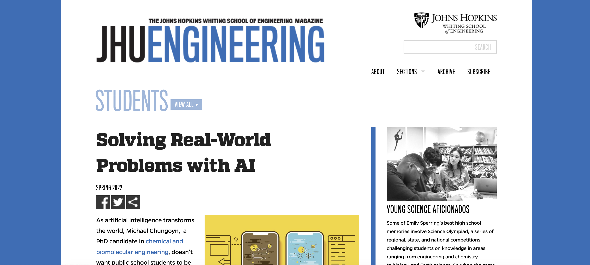

    

        
I have loved feeling empowered and fulfilled by conducting research, and so a goal of mine has been to create similar opportunities and experiences for younger scientists too. While at Johns Hopkins, I continue to develop outreach events in the surrounding Baltimore area for K – 12 schools. In 2022 I co-founded the <code>Hopkins Artificial Intelligence K-12 Education Program (HAIKU)</code>, with financial support from the <code>Johns Hopkins School of Engineering</code> and <code>InventXYZ</code>, a tech education company. The Johns Hopkins students within HAIKU develop 3 - 6 week education modules targeted to K-12 students, in topics ranging from computer vision applied to interpreting sign language, to generating novel artwork using text-to-image diffusion-based generative deep learning models. <a href="https://engineering.jhu.edu/magazine/2022/05/solving-real-world-problems-with-ai/">Click the preview image below to learn more!</a>

    

    

        
    

