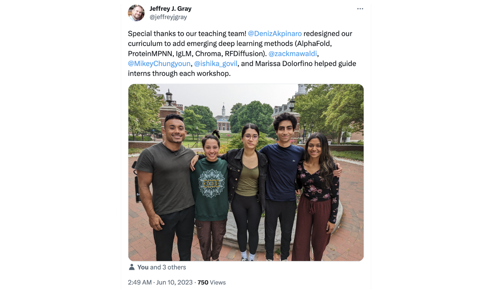

I have loved feeling empowered and fulfilled by conducting research, and so a goal of mine has been to create similar opportunities and experiences for younger scientists too. `Click the preview image below to learn more!`

### AI in K-12

While at Johns Hopkins, I continue to develop outreach events in the surrounding Baltimore area for K – 12 schools. In 2022 I co-founded the `Hopkins Artificial Intelligence K-12 Education Program (HAIKU)`, with financial support from the `Johns Hopkins School of Engineering` and `InventXYZ`, a tech education company. The Johns Hopkins students within HAIKU develop 3 - 6 week education modules targeted to K-12 students, in topics ranging from computer vision applied to interpreting sign language, to generating novel artwork using text-to-image diffusion-based generative deep learning models.

### Cutting-edge computational biology for undergraduate students

In summer 2023, I teamed up with four other PhD students to teach PyRosetta and deep learning tools in biomolecular structure prediction and design for 28 undergraduate students in preparation for their summer research. We covered various topics related to protein structure, energetics, and conformational searching. We provided hands-on tutorials for breaking down and using `AlphaFold`, `ProteinMPNN`, `IgLM`, `Chroma`, and `RFDiffusion`.

